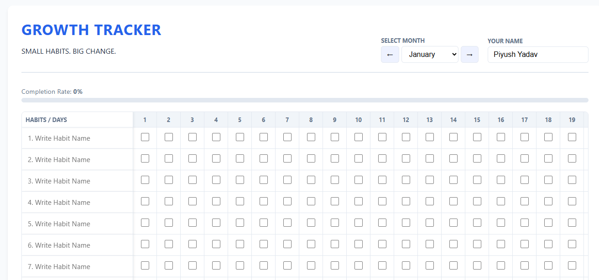

# 🌱 Minimalist Yearly Growth Tracker
# 🌱 Growth Tracker: Small Habits, Big Change

A beautiful, responsive, and privacy-focused habit tracker designed to help you stay consistent. Unlike other trackers, this one requires **no account** and **no database**. It uses your browser's local storage to keep your data safe and private on your own device.

## 🚀 Live Link
**[Try the Tracker Here](https://habitrackers.vercel.app/)**

---

## ✨ Why This Tracker?

* **🔒 100% Privacy:** Your data never touches a server. It stays in your browser's memory (`localStorage`).
* **📱 Mobile Ready:** Fully responsive design with a sticky "Habit Name" column for easy tracking on the go.
* **📅 Full Year Support:** Seamlessly switch between months. Data for January stays in January!
* **⚡ Auto-Save:** Never hit a "Save" button. Every tick and every letter you type is saved instantly.
* **💤 Sleep Tracking:** Integrated sleep tracker to monitor your rest patterns alongside your habits.

## 🛠️ Built With
* **HTML5** - Semantic structure
* **CSS3** - Responsive Grid & Flexbox
* **Vanilla JavaScript** - LocalStorage API for data persistence

## 🤝 Contribute to the Project
I want to make this the best habit tracker on GitHub! I am looking for contributors to help with:
* **🌙 Dark Mode:** Adding a toggle for nighttime use.
* **📊 Data Export:** Allowing users to download their data as a JSON or CSV file.
* **🎨 Custom Themes:** Adding color options for the progress bar.
* **📈 Weekly Stats:** Calculating weekly streaks.

---
*Created by Piyush Yadav*
